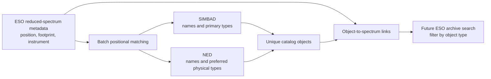

# ESO archive object-type enrichment prototype

## Executive summary

This project demonstrates how ESO archive products could be enriched with the
types of astronomical objects that fall within their observed sky footprint.

Today, an archive user usually searches using information already attached to
an observation, such as target name, instrument, wavelength, or position. This
prototype adds another discovery route:

> Find ESO spectra whose footprint contains a supernova, galaxy, quasar,
> stellar object, or another catalogued object type.

The idea follows the object-type search available in the ALMA Science Archive.
For each ESO spectrum, the prototype:

1. reads its position and footprint information from the ESO archive;
2. finds objects at that position in SIMBAD and NED;
3. records each object's preferred name and primary object type;
4. stores each catalog object only once; and
5. creates links between the object and every ESO spectrum that contains it.

The prototype works with metadata only. It does not download the spectral FITS
files and does not inspect whether an object was detected in the data.

## What question does this answer?

Imagine an archive user who wants to find all reduced spectra that may contain
a supernova. Without object-type enrichment, the user needs to know target
names, coordinates, or project details in advance.

With this enrichment, the archive could offer an **Object type** filter. The
user selects a type such as `Supernova`, and the archive returns every spectrum
whose footprint contains a SIMBAD or NED object classified as that type.

This improves data discovery because it connects ESO observations to
independent, continuously maintained astronomical knowledge bases.

## Prototype workflow



The current demonstration selects 50 reduced spectra from the public ESO
ObsCore service. It turns each spectrum's field of view into a small search
cone, sends the positions in batches, and stores the returned objects and
links in a local SQLite database.

### Why the objects and links are stored separately

The same astronomical object can appear in many ESO spectra. Repeating the
object's name, position, and type in every spectrum row would waste space and
make catalog updates difficult.

Instead, the prototype separates:

- the ESO spectrum;
- the catalog object; and
- the link saying that the object lies within that spectrum's footprint.

This is a many-to-many relationship:

- one spectrum can contain several catalog objects; and
- one catalog object can be linked to several spectra.

The catalog object is stored once, while the lightweight link can be repeated
for every relevant spectrum.

SIMBAD and NED records are kept separate even when they probably describe the
same astrophysical source. This preserves provenance and avoids unreliable
automatic merging between catalogs that do not share a universal identifier.

## Result from the 50-spectrum demonstration

The completed example run is
`20260723T193710Z-324ad2`.

| Result | Value | Meaning |
|---|---:|---|
| ESO spectra processed | 50 | Reduced-spectrum metadata records, no FITS downloads |
| Unique sky searches | 37 | Repeated positions were consolidated before querying |
| Unique catalog objects | 68 | Deduplicated within SIMBAD or NED |
| Object-to-spectrum links | 94 | Total positional relationships |
| Spectra with at least one match | 41 | A SIMBAD or NED object was found in the cone |
| Spectra with no match | 9 | A valid result, not a pipeline failure |
| External service calls | 3 | One ESO query, one SIMBAD batch, and one NED batch |
| Failed service calls | 0 | All services completed successfully |

These numbers show that the workflow and data model operate correctly. They
should not be interpreted as a scientific completeness measurement because
the sample is small, the search cones are simplified, and SIMBAD and NED have
different catalog scopes.

## How to interpret each output

All outputs are written under `output/`.

### `eso_object_types.sqlite`

This is the complete relational database and the source of truth for the
prototype. It contains the ESO spectra, catalog objects, object types, links,
run history, and service-call provenance.

For a production implementation, SQLite would be replaced by the archive's
production database technology. The logical separation between observations,
objects, and links would remain.

### `observations.csv`

One row per ESO spectrum included in the run.

Useful fields include:

- `eso_dp_id`: the unique ESO data-product identifier;
- `target_name`: the target name supplied with the ESO product;
- `ra_deg`, `dec_deg`: the spectrum position;
- `s_fov_deg` and `s_region`: ESO spatial metadata;
- `search_radius_deg`: the cone radius used by this prototype; and
- `instrument_name`: the ESO instrument.

This file answers: **Which ESO spectra were processed, and what footprint was
searched for each one?**

### `catalog_objects.csv`

One row per unique object returned by SIMBAD or NED.

Useful fields include:

- `catalog`: `simbad` or `ned`;
- `catalog_object_id`: the provider's stable identifier;
- `preferred_name`: the provider's preferred object name;
- `ra_deg`, `dec_deg`: the catalog position; and
- `primary_type_code`: the primary or preferred object classification.

This file answers: **Which external astronomical objects were found?**

### `object_types.csv`

One row per distinct object type used by the matched catalog objects.

SIMBAD supplies a type code, readable label, and description. NED currently
supplies its preferred physical-type code.

This file answers: **What do the stored classification codes mean?**

### `observation_objects.csv`

This is the bridge between ESO spectra and catalog objects.

Each row contains:

- an ESO data-product identifier;
- the source catalog and catalog object identifier;
- the angular separation between the ESO position and catalog position; and
- the run that created or last confirmed the link.

This file answers: **Which objects lie within which ESO spectra?**

To obtain the full human-readable result, join this file to:

- `observations.csv` using `eso_dp_id`; and
- `catalog_objects.csv` using both `catalog` and `catalog_object_id`.

### `run_summary.csv`

A compact manager-level summary containing:

- spectra and unique-position counts;
- matched and unmatched spectra;
- object and link counts;
- service calls and timings;
- counts by catalog and object type; and
- an extrapolation to two million spectra.

This is the best first output to show in a meeting.

### `logs/<run_id>.jsonl`

A structured audit log of what the pipeline did. It records the run, batching,
attempts, timing, returned row counts, retries, and final status.

This is primarily an operational and troubleshooting output. It demonstrates
that the enrichment can be monitored and resumed without silently losing work.

## Important interpretation limits

An object-to-spectrum link means:

> The catalog position falls inside the search region used for the ESO
> spectrum.

It does **not** establish that:

- the object was detected in the spectrum;
- the object was the observer's intended target;
- the object contributes significant flux;
- the catalog classification is complete or current; or
- two nearby SIMBAD and NED records represent different physical sources.

The current prototype uses a circular radius of
`max(s_fov / 2, 1 arcsec)`. This is suitable for testing the enrichment
workflow. A production system should validate the footprint by instrument and
product type and use the full ESO `s_region` geometry wherever possible.

Nine spectra in the demonstration have no catalog match. This is not an
error. Possible explanations include a small footprint, catalog coverage,
coordinate differences, or NED's focus on extragalactic objects.

## How this could become an ESO archive feature

The prototype separates the problem into components that can be implemented
and scaled independently.

### 1. Define the archive products and footprints

- Start with reduced one-dimensional spectra.
- Confirm how `s_fov` and `s_region` should be interpreted for each instrument.
- Extend later to images, cubes, or other products once their footprint rules
  are agreed.

### 2. Build a production object catalog

- Use SIMBAD's uploaded-table capability for large positional batches.
- Do not send millions of independent queries.
- For NED, obtain a versioned bulk snapshot or an explicitly approved bulk
  workflow.
- Preserve catalog identifiers, source catalog, retrieval date, and catalog
  version.

NED's public TAP service does not advertise uploaded coordinate tables. The
prototype's 50-cone batching is appropriate for a demonstration, but not for
an uncoordinated two-million-spectrum production run.

### 3. Perform the spatial matching near the archive database

- Deduplicate repeated ESO positions before matching.
- Partition the sky using HEALPix or the archive's preferred spatial index.
- Match ESO footprints against a locally staged external-object catalog.
- Store the unique objects and many-to-many observation links.
- Make ingestion idempotent so rerunning a batch does not create duplicates.

### 4. Add object type to archive discovery

The archive interface or API could expose:

- an object-type search field;
- catalog selection, such as SIMBAD, NED, or both;
- an option to show all objects inside the footprint;
- object names and types in the result details; and
- links back to the source catalog for provenance.

The database query is then straightforward: select an object type, follow its
catalog objects, follow the object-to-observation links, and return the
matching ESO products.

### 5. Operate and refresh the enrichment

- Record the external catalog version used for every enrichment run.
- Schedule incremental refreshes for new ESO products.
- Define how reclassified, merged, moved, or removed catalog objects are
  handled.
- Monitor matching rates, unmatched products, service failures, runtime, data
  growth, and dense-sky performance.
- Keep failed work resumable and completed batches immutable.

### 6. Validate scientifically before release

- Compare cone matching with real instrument apertures and `s_region`.
- Test sparse and crowded fields separately.
- Review false matches and missed matches with archive scientists.
- Decide whether the interface should distinguish objects in the footprint
  from likely primary targets or likely detections.

## Decisions for a broader implementation

The main decisions are organizational and scientific rather than purely
technical:

1. Which ESO data-product types should be included first?
2. What spatial footprint is authoritative for each product and instrument?
3. Which external catalogs and object-type vocabularies should be exposed?
4. Can NED provide or approve a bulk-access route?
5. How often should external classifications be refreshed?
6. Should the archive show all positional matches, likely main targets, or
   both?
7. Which team owns ongoing catalog ingestion, quality control, and monitoring?

## Suggested meeting walkthrough

For a short manager demonstration:

1. Start with the archive question in **What question does this answer?**
2. Show the workflow diagram.
3. Show `run_summary.csv` and the 50-spectrum result table above.
4. Open the notebook's object-type counts.
5. Change the example filter to `simbad:SN*` and show the returned ESO spectra.
6. Show the human-readable object list for each spectrum.
7. Finish with **How this could become an ESO archive feature** and the
   decisions required for a broader implementation.

## Explore the results in the notebook

The interpretation notebook automatically opens the SQLite database, selects
the latest run, and presents the outputs in a meeting-friendly form:

```bash
jupyter lab notebooks/interpret_outputs.ipynb
```

The notebook includes:

- run and service-call summaries;
- the ESO spectrum sample;
- matched names, types, and separations;
- object-type counts and a chart;
- an archive-style search by object type;
- a readable object list for every spectrum;
- unmatched spectra;
- data-integrity checks; and
- the two-million-spectrum scale estimate.

## Installation

### Conda environment

From the repository root:

```bash
conda create -n eso-object-types python=3.12 pip -y
conda activate eso-object-types
python -m pip install -e '.[test,notebook]'
```

### Python virtual environment

```bash
python3 -m venv .venv
.venv/bin/python -m pip install -e '.[test,notebook]'
```

## Run the prototype

```bash
eso-object-types run
```

The default run:

- selects 50 deterministic reduced-spectrum records from ESO ObsCore;
- uses `max(s_fov / 2, 1 arcsec)` as each search radius;
- consolidates repeated positions;
- submits the positions in one SIMBAD upload-table query;
- submits up to 50 cones in each asynchronous NED TAP query;
- writes `output/eso_object_types.sqlite`;
- writes `output/logs/<run_id>.jsonl`; and
- exports run-scoped CSV files under `output/<run_id>/`.

Useful options include:

```bash
eso-object-types run \
  --limit 50 \
  --min-radius-arcsec 1 \
  --simbad-batch-size 50000 \
  --ned-batch-size 50 \
  --retries 5 \
  --database output/eso_object_types.sqlite \
  --output-dir output
```

A partial run exits with status 2. Resume only unfinished work with:

```bash
eso-object-types run --resume-run <run_id>
```

Recreate the CSV reports for the latest run with:

```bash
eso-object-types report
```

Pass `--run-id <run_id>` to report on a specific run.

## Technical table reference

The SQLite database contains:

- `observations`: one row per ESO data product;
- `object_types`: normalized primary types for each catalog;
- `catalog_objects`: objects uniquely keyed by catalog and catalog ID;
- `observation_objects`: object-to-spectrum links and separations;
- `pipeline_runs`: run configuration and status;
- `run_observations`: observations belonging to each run; and
- `service_calls`: batch attempts, timings, results, and failures.

## Validation

The default test suite uses mock services and does not contact archives:

```bash
python -m pytest
```

The optional live test contacts ESO, SIMBAD, and NED for two spectra:

```bash
RUN_LIVE_TESTS=1 python -m pytest -m live -v
```

See [docs/scaling.md](docs/scaling.md) for the detailed production-scaling
notes.
